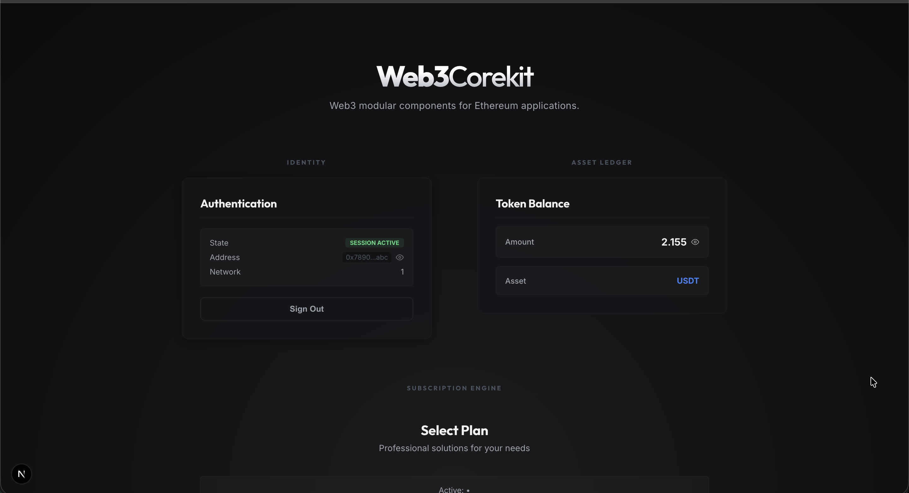
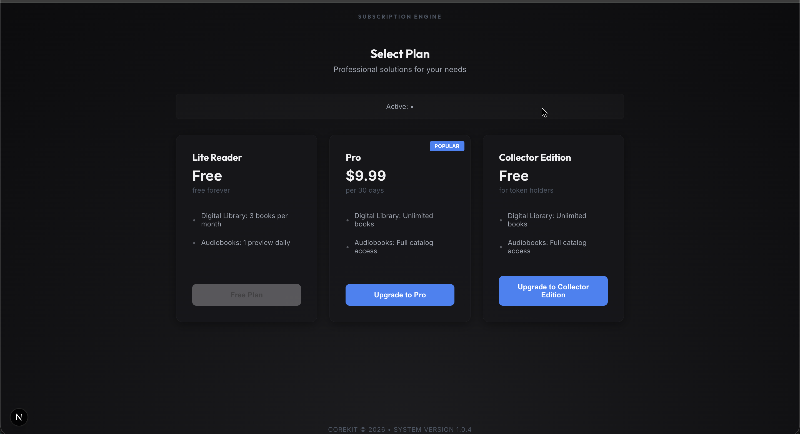

# 🧩 web3-corekit

Modular Web3 backend + frontend toolkit. Each module is **one file** — use any combination.




## Modules

| # | Backend | Frontend | What it does |
|---|---------|----------|-------------|
| 1 | `modules/auth.py` | `AuthModule.tsx` | SIWE wallet auth (Reown/WalletConnect) |
| 2 | `modules/crypto_payment.py` | `CryptoPaymentModule.tsx` | Crypto subscriptions + plans |
| 3 | `modules/balance_check.py` | `BalanceCheckModule.tsx` | ERC-20 token balance via Alchemy |

Auth is shared — modules 2 & 3 import `require_auth` from it.

## Quick Start

### Backend

```bash
cd backend
cp .env.example .env    # edit with your keys
pip install -r requirements.txt
python app.py
```

In `app.py`, comment out any module you don't need:
```python
register_module("modules.auth", "/api")              # Required
register_module("modules.crypto_payment", "/api")     # Optional
register_module("modules.balance_check", "/api")      # Optional
```

### Frontend

```bash
cd frontend
ln -sf ../backend/.env .env   # for NEXT_PUBLIC_ vars
npm install
npm run dev
```

### Tests

```bash
python -m pytest test_smoke.py -v
```

## Routes

| Route | Module | Auth? |
|-------|--------|-------|
| `GET /health` | app | ✗ |
| `GET /api/nonce` | auth | ✗ |
| `POST /api/verify` | auth | ✗ |
| `GET /api/session` | auth | ✓ |
| `POST /api/signout` | auth | ✓ |
| `GET /api/status` | auth | ✗ |
| `GET /api/crypto/plans` | crypto_payment | ✗ |
| `GET /api/crypto/my-subscription` | crypto_payment | ✓ |
| `POST /api/crypto/create-invoice` | crypto_payment | ✓ |
| `POST /api/crypto/webhook` | crypto_payment | ✗ (IPN) |
| `GET /api/crypto/user-plan` | crypto_payment | ✓ |
| `GET /api/balance` | balance_check | ✓ |
| `GET /api/is-holder` | balance_check | ✓ |

## Swapping Auth

Replace `modules/auth.py` with any module that exports a `require_auth` FastAPI dependency returning `{"address": "...", "chain_id": "..."}`.
